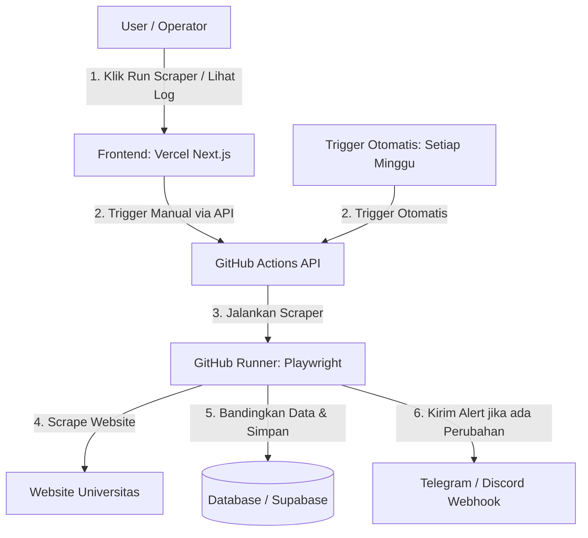

# Panduan Implementasi: Monitoring Scraper Otomatis (UI + GitHub Actions)

Dokumen ini berisi panduan lengkap untuk membuat User Interface (UI) di Vercel, mengatur penjadwalan otomatis mingguan menggunakan GitHub Actions, mendeteksi perubahan informasi halaman, dan mengirimkan notifikasi instan via Telegram/Discord.

---

## 🏗️ Arsitektur Sistem

Sistem ini memisahkan frontend (Vercel) dan backend runner (GitHub Actions) agar proses scraping yang memakan waktu lama dan RAM besar tidak terkena limitasi serverless Vercel:



---

## 📁 Struktur File Proyek

Tambahkan beberapa folder dan file berikut ke dalam repositori Anda:

```text
WebScraping-CourseCricos/
├── .github/
│   └── workflows/
│       └── weekly_monitor.yml      # Workflow GitHub Actions untuk penjadwalan otomatis
├── monitor_changes.py              # Script pendeteksi perbedaan data & pengirim notifikasi
├── upload_to_db.py                 # Script utilitas untuk sync data ke database cloud
├── web-dashboard/                  # Folder web frontend Next.js (Dideploy ke Vercel)
│   ├── app/
│   │   ├── api/
│   │   │   └── run-scraper/
│   │   │       └── route.ts        # API Route untuk trigger GitHub workflow dari UI
│   │   ├── page.tsx                # Halaman dashboard utama
│   │   └── layout.tsx
│   ├── package.json
│   └── tailwind.config.js
```

---

## 🛠️ Langkah 1: Pengaturan GitHub Actions Workflow
Buat file baru di `.github/workflows/weekly_monitor.yml`:

```yaml
name: Weekly Scraper & Change Monitor

on:
  schedule:
    # Berjalan otomatis setiap hari Minggu jam 00:00 UTC (07:00 WIB)
    - cron: '0 0 * * 0'
  workflow_dispatch:
    inputs:
      scraper_path:
        description: 'Path ke scraper (misal: "Crown Institute of Higher Education/cihe.py")'
        required: true
        default: 'all'

jobs:
  run-scraper:
    runs-on: ubuntu-latest

    steps:
      - name: Checkout Repository
        uses: actions/checkout@v3

      - name: Set up Python
        uses: actions/setup-python@v4
        with:
          python-version: '3.11'
          cache: 'pip'

      - name: Install Dependencies
        run: |
          pip install -r requirements.txt
          playwright install chromium

      - name: Run Scrapers and Detect Changes
        env:
          # Variabel lingkungan untuk integrasi database & notifikasi
          SUPABASE_URL: ${{ secrets.SUPABASE_URL }}
          SUPABASE_KEY: ${{ secrets.SUPABASE_KEY }}
          TELEGRAM_BOT_TOKEN: ${{ secrets.TELEGRAM_BOT_TOKEN }}
          TELEGRAM_CHAT_ID: ${{ secrets.TELEGRAM_CHAT_ID }}
          SCRAPER_PATH: ${{ github.event.inputs.scraper_path }}
        run: |
          # Jika dipicu otomatis (cron) jalankan semua, jika manual jalankan target
          if [ "${{ github.event_name }}" = "schedule" ] || [ "${{ env.SCRAPER_PATH }}" = "all" ]; then
            python monitor_changes.py --all
          else
            python monitor_changes.py --path "${{ env.SCRAPER_PATH }}"
          fi
```

---

## 🐍 Langkah 2: Script Deteksi Perubahan (`monitor_changes.py`)
Script ini berfungsi untuk membandingkan data hasil scraping terbaru dengan versi sebelumnya di database (Supabase) dan mengirimkan pesan notifikasi jika ditemukan perbedaan.

```python
import os
import sys
import argparse
import requests
import subprocess
from bs4 import BeautifulSoup

# Mengamankan output encoding console
sys.stdout.reconfigure(encoding="utf-8")

def send_telegram_alert(message):
    token = os.environ.get("TELEGRAM_BOT_TOKEN")
    chat_id = os.environ.get("TELEGRAM_CHAT_ID")
    if not token or not chat_id:
        print("⚠️ Telegram token/chat_id belum diset. Alert dilewati.")
        return
    
    url = f"https://api.telegram.org/bot{token}/sendMessage"
    payload = {
        "chat_id": chat_id,
        "text": message,
        "parse_mode": "Markdown"
    }
    try:
        res = requests.post(url, json=payload, timeout=10)
        if res.ok:
            print("🚀 Notifikasi Telegram terkirim!")
        else:
            print(f"❌ Gagal kirim Telegram: {res.text}")
    except Exception as e:
        print(f"❌ Error kirim notifikasi: {e}")

def run_single_scraper(scraper_path):
    print(f"⚙️ Menjalankan scraper: {scraper_path}")
    try:
        # Jalankan scraper python
        result = subprocess.run(
            [sys.executable, scraper_path],
            capture_output=True,
            text=True,
            encoding="utf-8",
            check=True
        )
        print(result.stdout)
        return True
    except subprocess.CalledProcessError as e:
        print(f"🔴 Scraper gagal dijalankan: {e}")
        print(e.stderr)
        return False

def compare_and_alert(institution_name, sql_file_path):
    """
    Membaca file SQL hasil scrape dan mendeteksi perubahan penting.
    Di sini Anda bisa membandingkannya dengan database Supabase atau local state.
    """
    if not os.path.exists(sql_file_path):
        print(f"⚠️ SQL file tidak ditemukan: {sql_file_path}")
        return

    print(f"🔍 Menganalisis file update SQL untuk {institution_name}...")
    
    # Contoh sederhana deteksi logik perubahan isi file:
    # Membaca query update dan mengecek teks didalamnya
    with open(sql_file_path, "r", encoding="utf-8") as f:
        sql_content = f.read()
        
    # LOGIKA BANDINGKAN DATA:
    # Pada implementasi nyata, Anda menembak Supabase / DB lokal untuk menarik data lama:
    #   old_data = db.query("SELECT * FROM courses WHERE institution = ...")
    #   Jika data_baru != old_data, kirim Telegram Alert.
    
    # Simulasi notifikasi deteksi perubahan sederhana:
    alert_msg = (
        f"🔔 *[Scraper Alert]* \n"
        f"Scraper untuk *{institution_name}* telah selesai berjalan.\n"
        f"Silakan periksa dashboard untuk mengunduh SQL update terbaru."
    )
    send_telegram_alert(alert_msg)

def main():
    parser = argparse.ArgumentParser()
    parser.add_argument("--all", action="store_true")
    parser.add_argument("--path", type=str)
    args = parser.parse_args()

    # Jalankan target scraper
    if args.all:
        print("🔄 Menjalankan seluruh scraper secara terjadwal...")
        # Tambahkan logika loop file python di repositori Anda
        # run_single_scraper("Crown Institute of Higher Education/cihe.py")
        # compare_and_alert("Crown Institute of Higher Education", "Crown Institute of Higher Education/cihe_courses_update.sql")
    elif args.path:
        success = run_single_scraper(args.path)
        if success:
            # Analisis perubahan
            folder = os.path.dirname(args.path)
            # cari file sql di dalam folder tersebut
            sql_files = [f for f in os.listdir(folder) if f.endswith(".sql")]
            if sql_files:
                sql_path = os.path.join(folder, sql_files[0])
                compare_and_alert(folder, sql_path)

if __name__ == "__main__":
    main()
```

---

## ⚡ Langkah 3: Membuat API Route Trigger di Next.js (Vercel)
Buat file `web-dashboard/app/api/run-scraper/route.ts` di project Next.js Anda:

```typescript
import { NextResponse } from 'next/server';

export async function POST(request: Request) {
  try {
    const { scraperPath } = await request.json();
    
    const githubRepo = process.env.GITHUB_REPO; // FORMAT: "username/repo-name"
    const githubToken = process.env.GITHUB_PAT;   // Token Akses Personal GitHub (Secrets)

    if (!githubRepo || !githubToken) {
      return NextResponse.json(
        { error: 'GitHub credentials belum diset di server environment.' },
        { status: 500 }
      );
    }

    // Memicu trigger workflow dispatch ke GitHub Actions
    const response = await fetch(
      `https://api.github.com/repos/${githubRepo}/actions/workflows/weekly_monitor.yml/dispatches`,
      {
        method: 'POST',
        headers: {
          'Authorization': `Bearer ${githubToken}`,
          'Accept': 'application/vnd.github.v3+json',
          'Content-Type': 'application/json',
        },
        body: JSON.stringify({
          ref: 'main', // Branch utama
          inputs: {
            scraper_path: scraperPath,
          },
        }),
      }
    );

    if (!response.ok) {
      const errText = await response.text();
      return NextResponse.json(
        { error: `Gagal memicu GitHub Action: ${errText}` },
        { status: response.status }
      );
    }

    return NextResponse.json({ success: true, message: 'Scraper berhasil diantrekan di GitHub!' });
  } catch (error: any) {
    return NextResponse.json({ error: error.message }, { status: 500 });
  }
}
```

---

## 💻 Langkah 4: Tampilan Dashboard UI (`app/page.tsx`)
Gunakan UI card yang menarik untuk mengontrol jalannya scraper dan mengunduh hasilnya:

```tsx
'use client';
import { useState } from 'react';

const scrapers = [
  { id: 1, name: 'Crown Institute of Higher Education', path: 'Crown Institute of Higher Education/cihe.py', status: 'Healthy' },
  { id: 2, name: 'Acknowledge Education', path: 'Acknowledge Education/acknowlede.py', status: 'Healthy' },
  { id: 3, name: 'Australian Institute of Higher Education', path: 'Australian Institute of Higher Education/aih.py', status: 'Healthy' }
];

export default function Dashboard() {
  const [runningId, setRunningId] = useState<number | null>(null);
  const [message, setMessage] = useState('');

  const handleRun = async (id: number, path: string) => {
    setRunningId(id);
    setMessage('');
    try {
      const res = await fetch('/api/run-scraper', {
        method: 'POST',
        headers: { 'Content-Type': 'application/json' },
        body: JSON.stringify({ scraperPath: path }),
      });
      const data = await res.json();
      if (data.success) {
        setMessage('✅ Berhasil mengirim perintah! Script sedang berjalan di background GitHub.');
      } else {
        setMessage(`❌ Gagal: ${data.error}`);
      }
    } catch (err) {
      setMessage('❌ Terjadi kesalahan koneksi.');
    } finally {
      setRunningId(null);
    }
  };

  return (
    <main className="min-h-screen bg-slate-900 text-slate-100 p-8">
      <div className="max-w-5xl mx-auto">
        <h1 className="text-3xl font-extrabold text-indigo-400 mb-2">AusCourseMiner Control Dashboard</h1>
        <p className="text-slate-400 mb-8">Kelola, jalankan, dan unduh data hasil scraping course dari satu panel terpusat.</p>
        
        {message && (
          <div className="mb-6 p-4 rounded-lg bg-indigo-950 text-indigo-200 border border-indigo-800">
            {message}
          </div>
        )}

        <div className="grid gap-6 md:grid-cols-2 lg:grid-cols-3">
          {scrapers.map((s) => (
            <div key={s.id} className="p-6 rounded-xl bg-slate-800 border border-slate-700 shadow-xl flex flex-col justify-between">
              <div>
                <div className="flex items-center justify-between mb-3">
                  <span className="text-xs font-semibold px-2.5 py-1 rounded bg-green-900/50 text-green-300 border border-green-700">
                    {s.status}
                  </span>
                  <span className="text-xs text-slate-500 font-mono">ID: {s.id}</span>
                </div>
                <h3 className="font-bold text-lg mb-2 text-white">{s.name}</h3>
                <p className="text-xs text-slate-500 font-mono mb-4 break-all">{s.path}</p>
              </div>

              <div className="mt-4 flex gap-2">
                <button
                  disabled={runningId !== null}
                  onClick={() => handleRun(s.id, s.path)}
                  className="flex-1 text-center py-2 rounded bg-indigo-600 hover:bg-indigo-500 text-white font-medium text-sm transition-all disabled:opacity-50"
                >
                  {runningId === s.id ? 'Running...' : 'Run Scraper'}
                </button>
              </div>
            </div>
          ))}
        </div>
      </div>
    </main>
  );
}
```

---

## 🔑 Langkah 5: Konfigurasi Environment & Token Keamanan

Untuk menghubungkan seluruh ekosistem ini, Anda wajib menyetel kunci kredensial berikut:

### Di Vercel Dashboard (Environment Variables)
* `GITHUB_REPO`: `username-anda/nama-repo-anda`
* `GITHUB_PAT`: Token Akses GitHub Anda (Dibuat di Profil GitHub -> Settings -> Developer Settings -> Personal Access Tokens -> Tokens classic. Centang scope `repo` & `workflow`).

### Di GitHub Repository (Settings -> Secrets and Variables -> Actions)
* `TELEGRAM_BOT_TOKEN`: Token bot Anda dari `@BotFather` di Telegram.
* `TELEGRAM_CHAT_ID`: ID chat grup/channel tempat notifikasi dikirimkan.
* `SUPABASE_URL` / `SUPABASE_KEY` (Opsional): Untuk sinkronisasi database.
